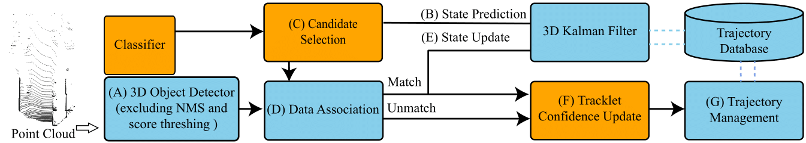

# 3D Multi-Object Tracking & New Evaluation Tool: A Filter-based Baseline with Tracklet Confidence and Candidate Selection

TC3DMOT is an online and accurate filter-based 3D MOT baseline to meet anticipated demand, which also reinforces the detector and tracker mutually with the proposed strategies.

It is also the official code release of TC3DMOT.


## Overview

- [Changelog](#Changelog)
- [Abstract](#Abstract)
- [Evaluation Tools](#Evaluation Tools)
- [Main Results](#3d-multi-object-tracking)
- [Installation](#Installation)
- [Acknowledgement](#acknowledgement)

### Changelog
[2020-12-31] MOT evaluation tools (2D MOT, 2D BEV MOT and 3D MOT) and 3D MOT results on KITTI "Car" category released

### Abstract

3D Multi-object tracking (MOT) provides crucial cues for other agents' trajectory prediction and safe navigation. 
Recent 3D MOT methods tend to develop practical systems with accuracy and efficiency in the tracking-by-detection paradigm. However, little attention is given to the trajectory confidence and unreliable detection. In contrast, we propose an accurate yet efficient online 3D MOT system characterized by handling unreliable detection by candidate selection from both detection and prediction and also extimating the trajectory confidence by the updated tracklet confidence in consideration of} the sequence's inter-frame consistency. {Besides, 3D MOT datasets such as KITTI still evaluate MOT methods on the image plane and ignore the trajectory confidence. Thus, we propose {new} MOT evaluation tools with the AMOTA and AMOTP metrics to fully understand 2D/3D MOT systems. Our proposed system runs at speed of 282 FPS on the KITTI dataset {with little system complexities. Extensive experiments show that our proposed system outperforms all previous 3D MOT systems on the standard KITTI 3D dataset, and our tracklet confidence updating strategy also promotes modern 2D/3D MOT systems. Notably, we achieve competitive performance (state-of-the-art performance among 3D MOT systems) on the KITTI 2D MOT leaderboard with none of the 2D data used.

<p align="center">
  
</p>
### Evaluation Tools

We provide 2D/2D BEV/3D MOT evaluation tools for extensive evaluation of the MOT system across the full spectrum of trajectory confidence thresholds. Please refer to [EVALUATION](evaluation/README.md) for usage of our evaluation tools.

### Main Results

#### 3D MOT Evaluation on KITTI MOT Validation Set

We experiment with different types of point cloud-based 3D object detectors such as SA-SSD, PointRCNN and PV-RCNNN, which are trained on the KITTI train split. The quantitative **3D MOT** results are on the KITTI val set for car.

| Detector  | FPS  | AMOTA(2D MOT) | AMOTP(2D MOT) | AMOTA(2D BEV MOT) | AMOTP(2D BEV MOT) | AMOTA(3D MOT) | AMOTP(3D MOT) | MOTA(3D MOT) | MOTP(3D MOT) | IDS(3D MOT) | FRAG(3D MOT) |
| --------- | ---- | ------------- | ------------- | ----------------- | ----------------- | ------------- | ------------- | ------------ | ------------ | ----------- | ------------ |
| SA-SSD    | 256  | 77.87         | 87.01         | 77.34             | 84.11             | 78.56         | 77.47         | 85.32        | 77.72        | 0           | 13           |
| PointRCNN | 245  | 67.60         | 85.77         | 66.68             | 82.64             | 69.08         | 75.36         | 81.70        | 75.95        | 0           | 22           |
| PV-RCNN   | 282  | 80.70         | 87.13         | 78.94             | 83.53             | 81.11         | 77.13         | 84.71        | 77.42        | 0           | 16           |

### Installation

Please refer to [INSTALL.md](doc/INSTALL.md) for the installation of **TC3DMOT** and relevant 3D object detectors.

### Acknowledgement
This project is not possible without multiple great open-sourced codebases. We list some notable examples below. 

- [AB3DMOT](https://github.com/xinshuoweng/AB3DMOT/blob/master/README.md)
- [OpenPCDet](https://github.com/open-mmlab/OpenPCDet)
- [SA-SSD](https://github.com/skyhehe123/SA-SSD/)


```
@article{Weng2020_AB3DMOT, 
author = {Weng, Xinshuo and Wang, Jianren and Held, David and Kitani, Kris}, 
journal = {IROS}, 
title = {{3D Multi-Object Tracking: A Baseline and New Evaluation Metrics}}, 
year = {2020} 
}

@inproceedings{shi2020pv,
  title={Pv-rcnn: Point-voxel feature set abstraction for 3d object detection},
  author={Shi, Shaoshuai and Guo, Chaoxu and Jiang, Li and Wang, Zhe and Shi, Jianping and Wang, Xiaogang and Li, Hongsheng},
  booktitle={Proceedings of the IEEE/CVF Conference on Computer Vision and Pattern Recognition},
  pages={10529--10538},
  year={2020}
}
@inproceedings{shi2019pointrcnn,
  title={PointRCNN: 3d Object Progposal Generation and Detection from Point Cloud},
  author={Shi, Shaoshuai and Wang, Xiaogang and Li, Hongsheng},
  booktitle={Proceedings of the IEEE Conference on Computer Vision and Pattern Recognition},
  pages={770--779},
  year={2019}
}

@inproceedings{he2020sassd,
title={Structure Aware Single-stage 3D Object Detection from Point Cloud},
author={He, Chenhang and Zeng, Hui and Huang, Jianqiang and Hua, Xian-Sheng and Zhang, Lei},
  booktitle={Proceedings of the IEEE Conference on Computer Vision and Pattern Recognition},
  year={2020}
}
```

